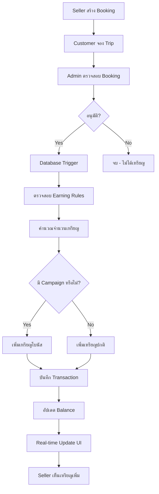
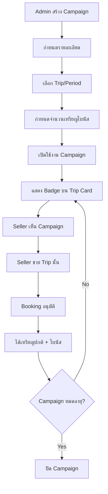
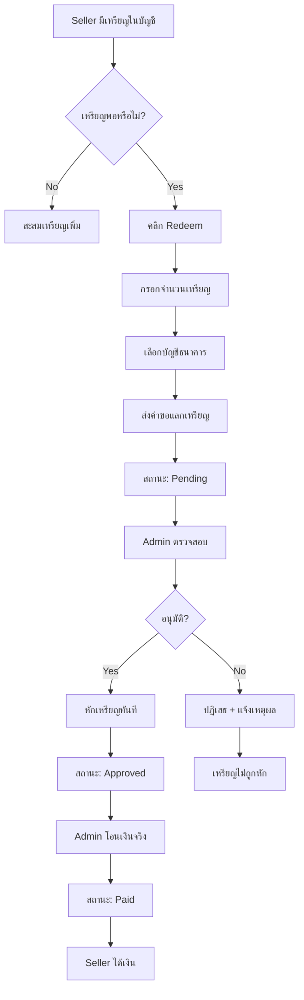

# ระบบ Coins - Flow และการทำงาน

เอกสารสำหรับการประชุมอธิบายการทำงานของระบบ Coins

**วันที่อัปเดต**: 20 ตุลาคม 2025

---

## 📋 สารบัญ

1. [ภาพรวมระบบ](#ภาพรวมระบบ)
2. [Flow หลักของระบบ](#flow-หลักของระบบ)
3. [User Flows](#user-flows)
4. [Technical Flow](#technical-flow)
5. [Database Flow](#database-flow)
6. [Business Rules](#business-rules)

---

## 🎯 ภาพรวมระบบ

### วัตถุประสงค์
ระบบ Coins เป็นระบบสะสมคะแนนและรางวัลสำหรับ Seller เพื่อ:
- **กระตุ้นยอดขาย**: ให้รางวัลเมื่อขายสำเร็จ
- **สร้างแรงจูงใจ**: มี Campaign โบนัสพิเศษ
- **สร้างระบบ Referral**: Seller ได้เหรียญเมื่อชวนคนอื่น
- **แลกเป็นเงิน**: แลกเหรียญเป็นเงินสดได้

### คุณสมบัติหลัก
✅ ได้เหรียญอัตโนมัติเมื่อ Booking อนุมัติ
✅ ระบบ Campaign โบนัสพิเศษ
✅ แลกเหรียญเป็นเงินสด
✅ ติดตามประวัติการทำธุรกรรม
✅ Admin จัดการระบบได้เต็มรูปแบบ

### อัตราแลกเปลี่ยน
```
1 Coin = 1 บาท
```

---

## 🔄 Flow หลักของระบบ

### 1. Coin Earning Flow (การได้เหรียญ)



**คำอธิบาย**:
1. Seller สร้าง Booking ให้ลูกค้า
2. Admin อนุมัติ Booking (เปลี่ยนสถานะเป็น 'approved')
3. Database Trigger ทำงานอัตโนมัติ
4. ตรวจสอบกฎการให้เหรียญ (Earning Rules)
5. ตรวจสอบว่ามี Campaign ที่ใช้ได้หรือไม่
6. บันทึกธุรกรรมและอัปเดตยอดคงเหลือ
7. แสดงผลแบบ Real-time ให้ Seller

---

### 2. Campaign Flow (แคมเปญโบนัส)



**ประเภท Campaign**:
- **Trip Specific**: โบนัสสำหรับ Trip เฉพาะ
- **Period Based**: โบนัสในช่วงเวลาที่กำหนด
- **Sales Target**: โบนัสเมื่อถึงยอดขาย

---

### 3. Redemption Flow (แลกเหรียญเป็นเงิน)



**ขั้นตอนการแลก**:
1. **Pending**: รอ Admin ตรวจสอบ
2. **Approved**: อนุมัติและหักเหรียญแล้ว
3. **Paid**: โอนเงินเรียบร้อย
4. **Rejected**: ปฏิเสธพร้อมเหตุผล

---

## 👥 User Flows

### Flow สำหรับ Seller

#### A. ดูยอดเหรียญ
```
1. Login เข้าระบบ
2. เห็นยอดเหรียญที่ Navigation Bar
   - Real-time update
   - แสดงจำนวนปัจจุบัน
3. คลิกดูรายละเอียดที่หน้า /dashboard/coins
   - ยอดคงเหลือ
   - ยอดที่ได้มาทั้งหมด
   - ยอดที่แลกไปแล้ว
```

#### B. รับเหรียญจากการขาย
```
1. สร้าง Booking ให้ลูกค้า
2. รอ Admin อนุมัติ
3. ได้รับแจ้งเตือน (ถ้ามี)
4. เห็นเหรียญเพิ่มขึ้นทันที
5. ตรวจสอบประวัติได้ที่ Transaction History
```

#### C. ดู Campaign และโบนัส
```
1. ไปที่หน้า Trips
2. เห็น Badge "🎁 +X Coins" บน Trip Card
3. คลิกดูรายละเอียด Campaign
4. ขาย Trip นั้นเพื่อรับโบนัส
```

#### D. แลกเหรียญเป็นเงิน
```
1. ไปที่หน้า /dashboard/coins
2. คลิกปุ่ม "Redeem Coins"
3. กรอก:
   - จำนวนเหรียญที่ต้องการแลก
   - เลือกบัญชีธนาคาร
4. ส่งคำขอ
5. รอ Admin อนุมัติ (2-5 วันทำการ)
6. ติดตามสถานะที่หน้า Redemption History
7. ได้เงินในบัญชี
```

---

### Flow สำหรับ Admin

#### A. จัดการ Campaigns
```
1. Login ด้วย Admin Account
2. ไปที่ /dashboard/admin/coins
3. Tab "Campaigns"
4. สร้าง Campaign ใหม่:
   - ชื่อและคำอธิบาย
   - ประเภท Campaign
   - จำนวนเหรียญโบนัส
   - เลือก Trip (ถ้าเป็น Trip Specific)
   - วันเริ่ม-สิ้นสุด
5. บันทึก → Campaign เปิดใช้งานทันที
6. แก้ไข/ปิดการใช้งานได้ตลอด
```

#### B. อนุมัติการแลกเหรียญ
```
1. ไปที่ Tab "Redemptions"
2. เห็นรายการคำขอ Pending
3. ตรวจสอบข้อมูล:
   - Seller
   - จำนวนเหรียญ/เงิน
   - บัญชีธนาคาร
4. อนุมัติหรือปฏิเสธ
   - อนุมัติ: เหรียญถูกหักทันที
   - ปฏิเสธ: ใส่เหตุผล
5. โอนเงินจริง
6. อัปเดตสถานะเป็น "Paid"
```

#### C. ปรับเหรียญด้วยตนเอง
```
1. Tab "Manual Adjustment"
2. เลือก Seller
3. กรอก:
   - จำนวน (+ หรือ -)
   - เหตุผล
   - คำอธิบาย
4. ยืนยัน
5. เหรียญปรับทันที + บันทึกประวัติ
```

#### D. ตั้งค่า Earning Rules
```
1. Tab "Earning Rules"
2. เพิ่มกฎใหม่:
   - ชื่อกฎ
   - ประเภท (booking, referral, etc.)
   - จำนวนเหรียญ
   - วิธีคำนวณ (fixed/percentage)
   - เงื่อนไข (ถ้ามี)
3. บันทึก
4. กฎใช้งานทันที
```

---

## ⚙️ Technical Flow

### Architecture Overview

```
┌─────────────┐
│   Client    │
│  (Browser)  │
└──────┬──────┘
       │
       │ HTTP/WebSocket
       │
┌──────▼──────────────────────┐
│   Next.js API Routes        │
│  /api/coins/*               │
│  /api/admin/coins/*         │
└──────┬──────────────────────┘
       │
       │ Supabase Client
       │
┌──────▼──────────────────────┐
│   PostgreSQL Database       │
│  - seller_coins             │
│  - coin_transactions        │
│  - coin_bonus_campaigns     │
│  - coin_redemptions         │
│  - coin_earning_rules       │
└──────┬──────────────────────┘
       │
       │ Triggers
       │
┌──────▼──────────────────────┐
│   Business Logic            │
│  - Auto coin calculation    │
│  - Campaign matching        │
│  - Balance updates          │
└─────────────────────────────┘
```

---

### API Request Flow

#### Example: Seller ดูประวัติธุรกรรม

```
1. User Request
   GET /api/coins?page=1&pageSize=20
   Headers: Authorization: Bearer <token>

2. API Route Handler
   - Verify user authentication
   - Get user_id from session
   - Query database

3. Database Query
   SELECT * FROM coin_transactions
   WHERE seller_id = <user_id>
   ORDER BY created_at DESC
   LIMIT 20 OFFSET 0

4. Response
   {
     "balance": {
       "balance": 1250,
       "total_earned": 2500,
       "total_redeemed": 1250
     },
     "transactions": [...],
     "pagination": {
       "currentPage": 1,
       "totalPages": 5,
       "total": 100
     }
   }

5. Client Update
   - แสดงข้อมูลใน UI
   - Cache ข้อมูล
```

---

### Real-time Update Flow

```
┌─────────────────────────────────────┐
│  Booking Approved                   │
└──────────┬──────────────────────────┘
           │
           ▼
┌─────────────────────────────────────┐
│  Database Trigger Fires             │
│  trigger_add_coins_on_booking_approval
└──────────┬──────────────────────────┘
           │
           ▼
┌─────────────────────────────────────┐
│  add_coins_for_approved_booking()   │
│  - คำนวณเหรียญ                      │
│  - เพิ่ม transaction                 │
│  - อัปเดต balance                   │
└──────────┬──────────────────────────┘
           │
           ▼
┌─────────────────────────────────────┐
│  API ส่ง Event                      │
│  window.dispatchEvent(              │
│    'coinBalanceUpdated'             │
│  )                                   │
└──────────┬──────────────────────────┘
           │
           ▼
┌─────────────────────────────────────┐
│  Components Listen                  │
│  - CoinBalanceIndicator             │
│  - CoinTransactionHistory           │
│  - CoinBalanceCard                  │
└──────────┬──────────────────────────┘
           │
           ▼
┌─────────────────────────────────────┐
│  Re-fetch Data                      │
│  GET /api/coins                     │
└──────────┬──────────────────────────┘
           │
           ▼
┌─────────────────────────────────────┐
│  UI Updates                         │
│  - แสดงยอดใหม่                      │
│  - แสดง transaction ใหม่            │
└─────────────────────────────────────┘
```

---

## 💾 Database Flow

### Transaction Flow (การบันทึกธุรกรรม)

```sql
-- 1. เริ่มต้น: Booking อนุมัติ
UPDATE bookings
SET status = 'approved'
WHERE id = '<booking_id>';

-- 2. Trigger ทำงานอัตโนมัติ
-- trigger_add_coins_on_booking_approval

-- 3. Function ทำงาน
-- add_coins_for_approved_booking()

-- 4. ดึงข้อมูล Booking
SELECT seller_id, total_price
FROM bookings
WHERE id = '<booking_id>';

-- 5. ตรวจสอบ Earning Rules
SELECT coin_amount, calculation_type
FROM coin_earning_rules
WHERE rule_type = 'booking'
  AND is_active = true
ORDER BY priority DESC
LIMIT 1;

-- 6. คำนวณจำนวนเหรียญ
-- ถ้า fixed: ให้ coin_amount ตามที่กำหนด
-- ถ้า percentage: (total_price * coin_amount / 100)

-- 7. ตรวจสอบ Campaign
SELECT id, coin_amount
FROM coin_bonus_campaigns
WHERE target_trip_id = '<trip_id>'
  AND is_active = true
  AND start_date <= NOW()
  AND end_date >= NOW();

-- 8. เพิ่ม Transaction (Base)
INSERT INTO coin_transactions (
  seller_id,
  transaction_type,
  source_type,
  source_id,
  amount,
  balance_before,
  balance_after,
  description
) VALUES (
  '<seller_id>',
  'earn',
  'booking',
  '<booking_id>',
  100,
  1000,
  1100,
  'เหรียญจากการขาย Trip: <trip_name>'
);

-- 9. เพิ่ม Transaction (Campaign Bonus)
-- ถ้ามี Campaign
INSERT INTO coin_transactions (
  seller_id,
  transaction_type,
  source_type,
  source_id,
  amount,
  balance_before,
  balance_after,
  description
) VALUES (
  '<seller_id>',
  'bonus',
  'campaign',
  '<campaign_id>',
  50,
  1100,
  1150,
  'โบนัสพิเศษจาก Campaign: <campaign_name>'
);

-- 10. อัปเดต Balance
UPDATE seller_coins
SET
  balance = balance + <total_coins>,
  total_earned = total_earned + <total_coins>,
  updated_at = NOW()
WHERE seller_id = '<seller_id>';

-- 11. Commit Transaction
COMMIT;
```

---

### Redemption Flow (Database Level)

```sql
-- 1. Seller ส่งคำขอแลกเหรียญ
INSERT INTO coin_redemptions (
  seller_id,
  coin_amount,
  cash_amount,
  conversion_rate,
  status,
  bank_account_id
) VALUES (
  '<seller_id>',
  1000,
  1000,
  1.0,
  'pending',
  '<bank_account_id>'
);

-- 2. Admin อนุมัติ
UPDATE coin_redemptions
SET
  status = 'approved',
  approved_at = NOW(),
  approved_by = '<admin_id>'
WHERE id = '<redemption_id>';

-- 3. หักเหรียญทันที (via Trigger)
-- ดึงยอดปัจจุบัน
SELECT balance FROM seller_coins
WHERE seller_id = '<seller_id>';

-- เพิ่ม Transaction
INSERT INTO coin_transactions (
  seller_id,
  transaction_type,
  source_type,
  source_id,
  amount,
  balance_before,
  balance_after,
  description
) VALUES (
  '<seller_id>',
  'redeem',
  'admin',
  '<redemption_id>',
  -1000,
  1500,
  500,
  'แลกเหรียญเป็นเงินสด: 1,000 บาท'
);

-- อัปเดต Balance
UPDATE seller_coins
SET
  balance = balance - 1000,
  total_redeemed = total_redeemed + 1000,
  updated_at = NOW()
WHERE seller_id = '<seller_id>';

-- 4. Admin โอนเงินและอัปเดตสถานะ
UPDATE coin_redemptions
SET
  status = 'paid',
  paid_at = NOW(),
  notes = 'โอนเงินเรียบร้อย'
WHERE id = '<redemption_id>';
```

---

## 📊 Business Rules

### 1. Earning Rules (กฎการได้เหรียญ)

| ประเภท | จำนวนเหรียญ | เงื่อนไข |
|--------|------------|---------|
| Booking ปกติ | 100 coins | Booking อนุมัติ |
| Campaign Trip | +50-200 coins | ตาม Campaign |
| Referral Bonus | 500 coins | Seller ใหม่ขายครั้งแรก |
| Sales Target | 1,000 coins | ยอดขายถึงเป้า |

### 2. Redemption Rules (กฎการแลก)

```yaml
ขั้นต่ำ: 500 coins (500 บาท)
ไม่จำกัดสูงสุด: แลกได้เท่าที่มี
ระยะเวลา: 2-5 วันทำการ
ค่าธรรมเนียม: ไม่มี
วิธีรับเงิน: โอนเข้าบัญชีธนาคาร
```

### 3. Campaign Rules (กฎ Campaign)

```yaml
ระยะเวลา:
  - ขั้นต่ำ: 1 วัน
  - สูงสุด: ไม่จำกัด

การใช้งาน:
  - ได้โบนัสทันทีเมื่อ Booking อนุมัติ
  - นับโบนัสเฉพาะ Booking ในช่วงเวลา Campaign
  - 1 Booking สามารถได้หลาย Campaign (ถ้าเงื่อนไขตรงกัน)

การหมดอายุ:
  - Campaign ปิดอัตโนมัติเมื่อถึงวันสิ้นสุด
  - Admin ปิดด้วยตนเองได้ตลอด
```

### 4. Security Rules (กฎความปลอดภัย)

```yaml
RLS Policies:
  - Seller เห็นเฉพาะข้อมูลของตัวเอง
  - Seller ไม่สามารถแก้ไข balance โดยตรง
  - Admin เห็นและแก้ไขได้ทั้งหมด

Transaction Immutability:
  - coin_transactions ไม่สามารถแก้ไขหรือลบได้
  - เป็น audit trail ถาวร

Validation:
  - จำนวนเหรียญไม่ติดลบ
  - ยอดแลกต้องไม่เกิน balance
  - บัญชีธนาคารต้องเป็นของ Seller เอง
```

---

## 🎨 UI/UX Flow

### Seller Interface

#### หน้า Dashboard (/dashboard/coins)
```
┌─────────────────────────────────────────────┐
│ 💰 ยอดเหรียญของคุณ                          │
│                                              │
│  [1,250]    [2,500]      [1,250]            │
│  คงเหลือ     ได้มาทั้งหมด    แลกไปแล้ว      │
│                                              │
│  [ปุ่ม: Redeem Coins]                       │
└─────────────────────────────────────────────┘

┌─────────────────────────────────────────────┐
│ 🎁 แคมเปญที่กำลังมี                         │
│                                              │
│  [Card 1: Summer Sale +200 Coins]           │
│  [Card 2: Weekend Bonus +100 Coins]         │
└─────────────────────────────────────────────┘

┌─────────────────────────────────────────────┐
│ 📜 ประวัติการทำธุรกรรม                       │
│                                              │
│  🔹 20 ต.ค. 2025 | +100 | Booking: Trip A  │
│  🎁 19 ต.ค. 2025 | +50  | Campaign Bonus   │
│  💸 18 ต.ค. 2025 | -1000| แลกเป็นเงินสด     │
│                                              │
│  [Load More...]                             │
└─────────────────────────────────────────────┘
```

---

### Admin Interface

#### หน้า Admin Coins (/dashboard/admin/coins)
```
┌─────────────────────────────────────────────┐
│ 📊 Dashboard Overview                        │
│                                              │
│  Total Distributed: 50,000 Coins            │
│  Total Redeemed: 15,000 Coins               │
│  Active Balance: 35,000 Coins               │
│  Pending Redemptions: 5,000 Coins           │
└─────────────────────────────────────────────┘

[Tab: Overview | Campaigns | Redemptions | Rules | Manual Adjust]

┌─────────────────────────────────────────────┐
│ 🎯 Active Campaigns                          │
│                                              │
│  [Table with Campaign List]                 │
│  [ปุ่ม: Create New Campaign]                │
└─────────────────────────────────────────────┘

┌─────────────────────────────────────────────┐
│ ✅ Redemption Requests                       │
│                                              │
│  [Table with Pending Requests]              │
│  [ปุ่ม Approve | Reject แต่ละรายการ]        │
└─────────────────────────────────────────────┘
```

---

## 🔐 Security & Validation

### Data Flow Security

```
Client Side
  │
  ├─ แสดงผลเท่านั้น
  ├─ ไม่สามารถแก้ไขยอดได้
  └─ Validate form input only

API Layer
  │
  ├─ Verify JWT token
  ├─ Check user role
  ├─ Validate request data
  └─ Rate limiting

Database Layer
  │
  ├─ RLS policies
  ├─ Check constraints
  ├─ Triggers for business logic
  └─ Transaction isolation
```

---

## 📈 Performance Considerations

### Caching Strategy
```yaml
API Responses:
  - Cache duration: 30 seconds
  - Key format: coins:<user_id>:balance

Static Data:
  - Campaigns: 5 minutes
  - Earning Rules: 10 minutes

Real-time Updates:
  - Event-driven invalidation
  - WebSocket for instant updates
```

### Database Optimization
```sql
-- Indexes for performance
CREATE INDEX idx_coin_transactions_seller_id ON coin_transactions(seller_id);
CREATE INDEX idx_coin_transactions_created_at ON coin_transactions(created_at DESC);
CREATE INDEX idx_coin_redemptions_status ON coin_redemptions(status);
CREATE INDEX idx_campaigns_dates ON coin_bonus_campaigns(start_date, end_date);
```

---

## 🚀 Future Enhancements

### Phase 2 (Q1 2026)
- [ ] ระบบ Tier (Bronze/Silver/Gold)
- [ ] Leaderboard รายเดือน
- [ ] Push notifications สำหรับได้เหรียญ
- [ ] Mobile app integration

### Phase 3 (Q2 2026)
- [ ] Coin expiry system
- [ ] Automated payouts
- [ ] Advanced analytics dashboard
- [ ] Gamification features

---

## 📞 Contact & Support

**Technical Questions**:
- Check: `COIN_SYSTEM_GUIDE.md` (Developer Guide)
- Check: `CLAUDE.md` (Project Setup)

**Business Questions**:
- ติดต่อ Product Manager
- Email: support@gography.com

---

## 📝 Summary for Meeting

### จุดเด่นที่ควรนำเสนอ:

1. **ระบบทำงานอัตโนมัติ 100%**
   - Booking อนุมัติ → ได้เหรียญทันที
   - ไม่ต้องคำนวณด้วยตนเอง

2. **Real-time Updates**
   - Seller เห็นยอดเหรียญเพิ่มทันที
   - ไม่ต้อง refresh หน้า

3. **Flexible Campaign System**
   - Admin สร้าง Campaign ได้ง่าย
   - ปรับเปลี่ยนได้ตลอดเวลา

4. **Security & Audit Trail**
   - ทุก transaction บันทึกถาวร
   - ป้องกันการโกงด้วย RLS

5. **User-Friendly Interface**
   - Seller: เข้าใจง่าย ใช้งานสะดวก
   - Admin: จัดการได้เต็มรูปแบบ

---

**เอกสารนี้สร้างเมื่อ**: 20 ตุลาคม 2025
**Version**: 1.0
**สำหรับ**: การประชุมอธิบายระบบ Coins
